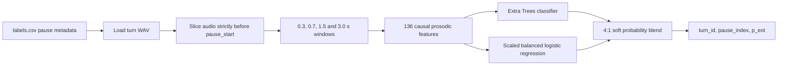

# End-of-Turn Detection from Causal Audio

CPU-only bilingual end-of-turn detection for live voice agents.

| Submission field | Value |
|---|---|
| Roll number | `23CH3FP02` |
| Repository | `plivo-ml-23CH3FP02` |
| Languages | English and Hindi |
| Training examples | 200 turns, 496 annotated pauses |
| Final model | 4:1 Extra Trees / logistic-regression soft blend |
| Feature count | 136 causal features |
| External data or pretrained weights | None |

## Executive summary

A live voice agent must decide at every silence whether the user has finished or is only pausing. Responding too soon interrupts the user; responding too late makes the conversation feel slow. This project predicts `p_eot`, the probability of a true end of turn, for each annotated pause.

The final system uses only information already available when speech stops. It combines energy, pitch, voicing, rhythm, and causal turn-position features over four recent context windows. A nonlinear Extra Trees classifier provides most of the final probability, while a balanced logistic-regression component smooths its decisions.

On five-fold grouped out-of-fold validation, the system reduces English mean response delay from **1600 ms to 1078 ms** while staying at the permitted **5% interrupted-turn ceiling**. Hindi AUC improves from **0.516 to 0.790**, although its discrete delay score remains tied with an unusually favorable 850 ms silence-only baseline.

## Problem definition

Each WAV contains one complete user turn. `labels.csv` contains one row for every silence pause of at least 100 ms:

| Column | Meaning |
|---|---|
| `turn_id` | Turn identifier matching the WAV filename |
| `audio_file` | Relative path to the WAV |
| `pause_index` | Zero-based pause number observed so far in the turn |
| `pause_start` | Time at which speech stops |
| `pause_end` | Time at which speech resumes or the file ends |
| `label` | `hold` when the user continues, otherwise `eot` |

The required prediction schema is:

```text
turn_id,pause_index,p_eot
```

The official scorer sweeps probability thresholds and action delays. It reports the lowest mean EOT response delay achievable while interrupting no more than 5% of turns.

## Hard causality guarantee

For a pause at `pause_start`, a live system cannot hear the pause duration or anything that follows it. The acoustic feature extractor therefore establishes one boundary before any analysis:

```python
end = floor(pause_start * sample_rate)
past = waveform[:end]
```

Every acoustic window is taken from `past`. The feature API accepts only:

```python
extract_features(waveform, sample_rate, pause_start, pause_index)
```

It does not accept or use `pause_end`, pause duration, the target label, or post-pause samples. `pause_index` is causal because it is simply the count of pauses already encountered. The submitted feature code was dynamically tested on all 496 supplied annotations by replacing every sample at and after `pause_start` with random noise; all feature vectors remained bit-for-bit identical.

## System architecture



Inference is completely separate from training. `predict.py` loads the fitted `eot_model.joblib` artifact and only calls `predict_proba`; it contains no `fit`, `partial_fit`, or refitting path.

## Feature engineering

Features are evaluated over the final **0.3 s, 0.7 s, 1.5 s, and 3.0 s** before each pause. Multiple windows let the model compare the immediate speech boundary with longer phrase-level context.

### Energy and boundary shape

- Mean, standard deviation, minimum, maximum, median, and quartiles of frame energy.
- Final-frame and recent-frame energy.
- Energy slope and the difference between the first and second half of a window.
- Active-frame ratio and activity immediately before the pause.
- Local energy-peak rate as a rough causal syllable/rhythm proxy.

### Pitch and voicing

- Autocorrelation F0 tracking between approximately 60 and 400 Hz.
- Log-F0 mean, spread, range, median, and quartiles.
- Final F0, recent voiced-frame slope, and final F0 relative to the window median.
- Overall and boundary voiced-frame ratios.
- Duration of the final contiguous voiced island.
- Time between the final voiced frame and `pause_start`.

### Additional acoustic and positional context

- Zero-crossing-rate level, variation, slope, and boundary value.
- Elapsed speech context at `pause_start`.
- Causal `pause_index` and logarithmic versions of positional values.

Missing, silent, non-finite, and very short contexts are handled deterministically without reading future audio.

## Final model

The final probability is a soft-voting blend:

- **Extra Trees, weight 4:** 500 trees, minimum leaf size 4, 70% feature sampling, balanced class weights, deterministic seed, and CPU-only execution.
- **Logistic regression, weight 1:** median imputation, standardization, balanced class weights, `C=0.25`, and deterministic seed.

Extra Trees captures nonlinear interactions among energy, pitch, voicing, and position. Logistic regression adds a lower-variance linear component that smooths the probability surface. The final artifact was fitted on the combined English and Hindi development data after model selection.

## Dataset summary

| Language | Turns | Pauses | Hold | EOT | Mean pauses per turn | Range |
|---|---:|---:|---:|---:|---:|---:|
| English | 100 | 248 | 148 | 100 | 2.48 | 1–8 |
| Hindi | 100 | 248 | 148 | 100 | 2.48 | 1–8 |
| Combined | 200 | 496 | 296 | 200 | 2.48 | 1–8 |

English includes hold pauses as long as 3.0 seconds, which makes a conservative silence timer expensive. Hindi hold pauses are shorter—the longest supplied example is 1.5 seconds—so its silence-only baseline already reaches the 5% interruption boundary at an 850 ms delay.

The supplied phone-call recordings are intentionally not published in this public repository. The evaluator supplies a folder with the same schema for inference.

## Validation methodology

Model selection uses five-fold `GroupKFold` validation. The group identifier combines the language folder and `turn_id`, ensuring that every pause from a turn stays entirely within either the training or validation side of a fold.

This matters because randomly splitting individual pauses would leak turn-specific acoustic and positional information. The grouped out-of-fold predictions are the honest development estimate and are the primary results reported below and in `SUMMARY.html`.

After selecting the model, it was fitted on all supplied development turns to produce the saved artifact and required provided-data prediction CSVs. Scores on those fitted rows are reported only as file diagnostics, never as unseen performance.

## Results

### Silence-only baseline

| Language | Mean delay at ≤5% interruptions | Interrupted turns | AUC | Operating point |
|---|---:|---:|---:|---|
| English | 1600 ms | 0.0% | 0.506 | threshold 1.00, delay 1600 ms |
| Hindi | 850 ms | 5.0% | 0.516 | threshold 0.05, delay 850 ms |

### Final grouped out-of-fold validation

| Language | Mean delay at ≤5% interruptions | Interrupted turns | AUC | Operating point |
|---|---:|---:|---:|---|
| English | **1078 ms** | 5.0% | 0.691 | threshold 0.50, delay 650 ms |
| Hindi | **850 ms** | 5.0% | 0.790 | threshold 0.05, delay 850 ms |

The English delay reduction is **522 ms**, approximately **32.6%**, at the allowed interruption ceiling. Hindi ranking improves substantially even though the scorer's coarse operating-point sweep leaves mean delay tied with the silence baseline.

### Required provided-data prediction files

| File | Mean delay | Interrupted turns | AUC | Interpretation |
|---|---:|---:|---:|---|
| `predictions_english.csv` | 100 ms | 5.0% | 1.000 | Fitted-data diagnostic |
| `predictions_hindi.csv` | 100 ms | 5.0% | 1.000 | Fitted-data diagnostic |

These 100 ms / 1.000 AUC values are expected to be optimistic because the final artifact was fitted on these rows. They validate the required output files but must not be interpreted as hidden-test or unseen-turn performance.

## Error analysis

High-scored continuation errors include `en__090` pause 1, a 1.6-second hold with grouped-OOF score 0.774, and `hi__085` pause 1, a 0.5-second hold with score 0.720. Their pre-pause acoustic features resemble completed phrases.

Low-scored true endings include `en__078` pause 0 with score 0.133 and `hi__033` pause 2 with score 0.137. Their endings appear nonterminal to the available acoustic features. These cases expose the remaining limitation of prosody without lexical or dialogue-state information.

## Repository contents

| File | Purpose |
|---|---|
| `SUMMARY.html` | Detailed visual assignment report and primary honest results |
| `predict.py` | Required inference entry point |
| `predictions_english.csv` | Required English supplied-data predictions |
| `predictions_hindi.csv` | Required Hindi supplied-data predictions |
| `RUNLOG.md` | Baseline, ablations, iterations, final selection, and verification runs |
| `NOTES.md` | Required short model summary, failure cases, and next steps |
| `eot_model.joblib` | Saved fitted classifier loaded by `predict.py` |
| `eot_features.py` | Causal feature implementation required by `predict.py` |
| `README.md` | Complete project documentation and usage guide |

The first six files are the named assignment deliverables. The model and feature module are required runtime dependencies. The README documents the complete project without publishing the raw call recordings or unnecessary intermediate artifacts.

## Environment

The submission was validated with:

- Python 3.12.13 on native Apple Silicon `arm64`.
- NumPy, SciPy, scikit-learn, joblib, and soundfile.
- `setuptools 80.10.2`, `numba 0.60.0`, and `llvmlite 0.43.0` in the prepared assignment environment.
- CPU-only execution; no GPU is required.

Minimal inference dependencies can be installed with:

```bash
python -m pip install numpy scipy scikit-learn joblib soundfile
```

For maximum joblib compatibility, use the prepared assignment environment. The saved artifact was produced with scikit-learn 1.9.0.

## Data layout

Place an evaluator-provided folder anywhere on disk with this structure:

```text
<data_dir>/
├── labels.csv
└── audio/
    ├── example_000.wav
    └── ...
```

`predict.py` reads `turn_id`, `audio_file`, `pause_index`, and `pause_start`. It does not read the target `label`, `pause_end`, or pause duration for feature extraction or prediction.

## Required inference command

Run from the repository root:

```bash
python predict.py --data_dir <folder> --out predictions.csv
```

Examples:

```bash
python predict.py --data_dir eot_data/english --out predictions_check_english.csv
python predict.py --data_dir eot_data/hindi --out predictions_check_hindi.csv
```

Expected terminal output:

```text
wrote 248 predictions -> predictions_check_english.csv
```

The output contains one row for every input annotation and probabilities are constrained to `[0, 1]`.

## Scoring with the assignment handout

The official `starter/score.py` is part of the supplied assignment handout rather than this submission repository. With that scorer available, run:

```bash
python starter/score.py --data_dir eot_data/english --pred predictions_english.csv
python starter/score.py --data_dir eot_data/hindi --pred predictions_hindi.csv
```

To score the model on a new evaluator-provided folder:

```bash
python predict.py --data_dir <folder> --out predictions.csv
python starter/score.py --data_dir <folder> --pred predictions.csv
```

## Verification completed before submission

- All named deliverables and runtime dependencies are present and non-empty.
- `predict.py` runs through the exact required CLI.
- Clean inference regenerated both 248-row required prediction files exactly.
- Every prediction CSV has the required schema, complete ordered keys, unique `(turn_id, pause_index)` pairs, and probabilities in `[0, 1]`.
- The saved artifact reports feature version 1, 136 features, and English/Hindi training languages.
- `predict.py` loads the saved model and contains no training or refitting call.
- Feature extraction has no `pause_end`, duration, or target-label input.
- Future-audio invariance passed dynamically for all 496 supplied pauses.
- `NOTES.md` contains 8 sentences, below the 10-sentence maximum.
- `SUMMARY.html` leads with grouped OOF results and explicitly labels fitted-data scores as diagnostics.
- Markdown and HTML passed strict UTF-8 and mojibake checks.

## Assignment-rule compliance

- Laptop CPU only.
- No GPU or cloud training.
- No pretrained model or downloaded weights.
- No Whisper, wav2vec, Silero, WebRTC VAD, Hugging Face model, or external ASR/TTS API.
- No external datasets.
- No samples at or after `pause_start` used in features.
- No target labels used during inference.
- Complete turns kept together during validation.

## Human and coding-agent contributions

The human installed and verified the required CPU environment, supplied the assignment materials and execution plan, selected the final submission scope, and remains responsible for listening-based interpretation and explaining the system during discussion.

The coding agent audited the requirements, implemented causal features, trained and compared the candidate models, performed grouped scoring and error analysis, generated the model and predictions, validated causality and schemas, produced the reports, and prepared the public submission repository.

## Limitations and next steps

- Hidden-test performance cannot be measured locally; grouped OOF is the available generalization estimate.
- The blend weight was selected using supplied grouped validation, creating mild model-selection optimism.
- Hindi AUC improves strongly, but more work is needed to turn ranking gains into lower constrained latency.
- Prosody alone cannot reliably distinguish every syntactically complete hold from a true ending.
- The joblib artifact is most portable when scikit-learn versions match.

With additional development time, the next steps would be nested grouped tuning for the constrained latency objective, speaker-relative normalization, richer voiced-region timing, systematic categorization of the worst errors, and locally trained lexical/context features that remain within the assignment's no-pretrained-model rule.

## Final conclusion

This submission replaces one-size-fits-all silence endpointing with a causal, CPU-efficient probability model. It demonstrates a meaningful English latency reduction at the required interruption ceiling, substantially improves Hindi ranking, works through the exact required command, and preserves the live-agent causality constraint throughout the implementation.
